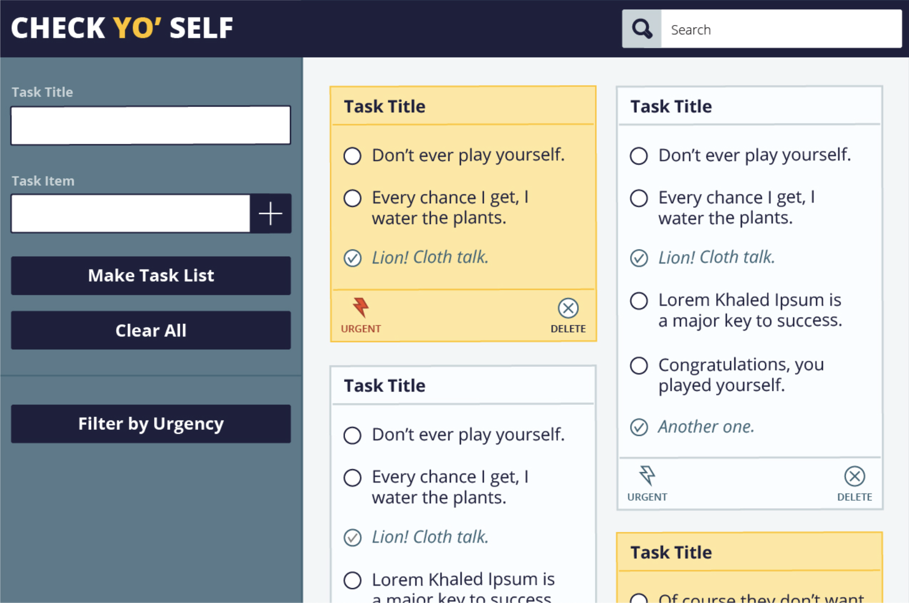
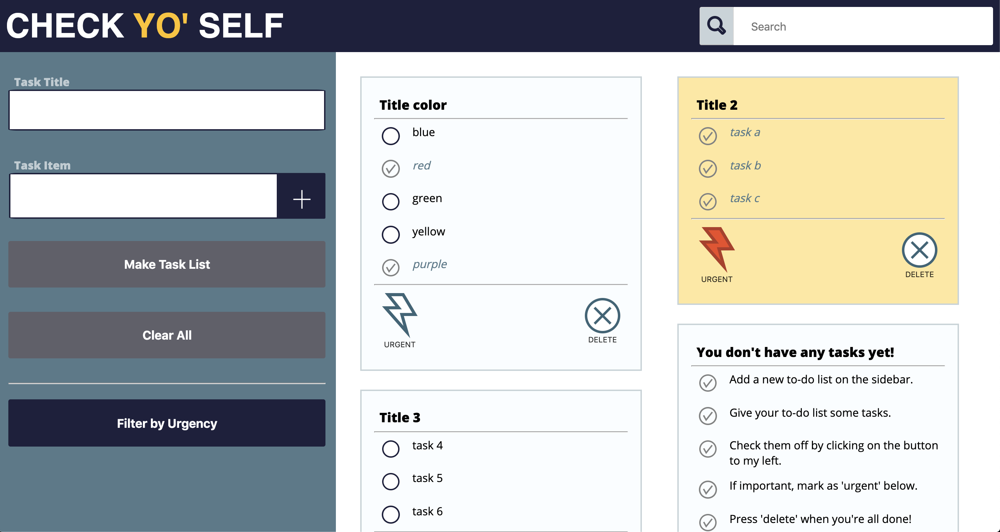

# CheckYoSelf
#### Learning Goals 
-   Solidify and demonstrate your understanding of:
    -   clean & organized CSS styles
    -   DRY JavaScript
    -   localStorage to persist data
-   Iterate through/filter DOM elements using  `for`  loops
-   Understand the difference between the data model and how the data is displayed on the DOM
-   Ability to match/recreate a UI and create a great UX

#### Team
- Vee Andrade
- Cody Smith
- Allie McCarthy

#### Abstract 
The purpose of this project was to guide our exploration into the foundations of classes, objects, and local storage.
The objective was to design an app that would take in user input in the form of a 'to-do' list, the user was able to
check off each task as needed and change the state of each 'todo' list card in accordance to it's urgency. All the data
on the page had to persist when the user refreshed the page. 
#### Classes and Objects
In this function, we are running through a for loop that runs through our task list array. This task list array contains
the users' list items. With this function we instantiate each list item into our 'to-do list' class.
```
function  instantiateTaskList() {
	var taskListArray = document.querySelectorAll("#taskText");
	for (var i =  0; i < taskListArray.length; i++) {
	var taskListObject =  new Task(taskListArray[i].innerText);
	allTasksArray.push(taskListObject);
	}
}
```
#### Local Storage
This is a simple snippet demonstrating a specific place in our class object, where we save the user info into local
storage using JSON. 
```
saveToStorage(bigArray) {
localStorage.setItem("bigArray", JSON.stringify(bigArray));
}
```
#### Trial & Error 
Throughout our project, we struggled with the concept of local storage. Retrieving the information that was saved to be
more exact. once we did manage to obtain the objects that were being saved, we also had to reinstantiate that as they came
out of local storage with no links to the class object. Another struggle we had, was the requirement of a vertical Masonry
layout. Our solution would be to creat a function that evaluates each card and determines which column is best suited. 

### Original comp


### Our comp


------
| Terms learned in this project | Definition | 
| ------------- | ---------- | 
| Client-side Storage | Storage on the client (usually the browser)|
| Server-side storage| Storage on the server|
|   localStorage |An implementation of Client-side Storage|
|JSON |  (JavaScript Object Notation) is a lightweight data-interchange format|
|  data-attributes|  A way of storing information related to the data model on an html element|
| Object| A bundle of behavior (methods) and state (properties)|
| Key|  The name used to reference a Value on an Object
| Value |  The data referenced by a Key
| Property|  Another word for the ‘Key’ portion of a key-value pair on an object
| Method |  A function on an Object
| Dot Notation  | Notation to access a Value on an Object, explicitly specifies the Key
 |Bracket Notation|  Notation to access a Value on an Object, usually specifies a Key via a variable
 |`this`  |A variable that changes depending on the context in which it’s used
| Class |  A constructor that allows us to create multiple instances
 | Object Instance |  Objects that contain the data and functionality defined in the class
